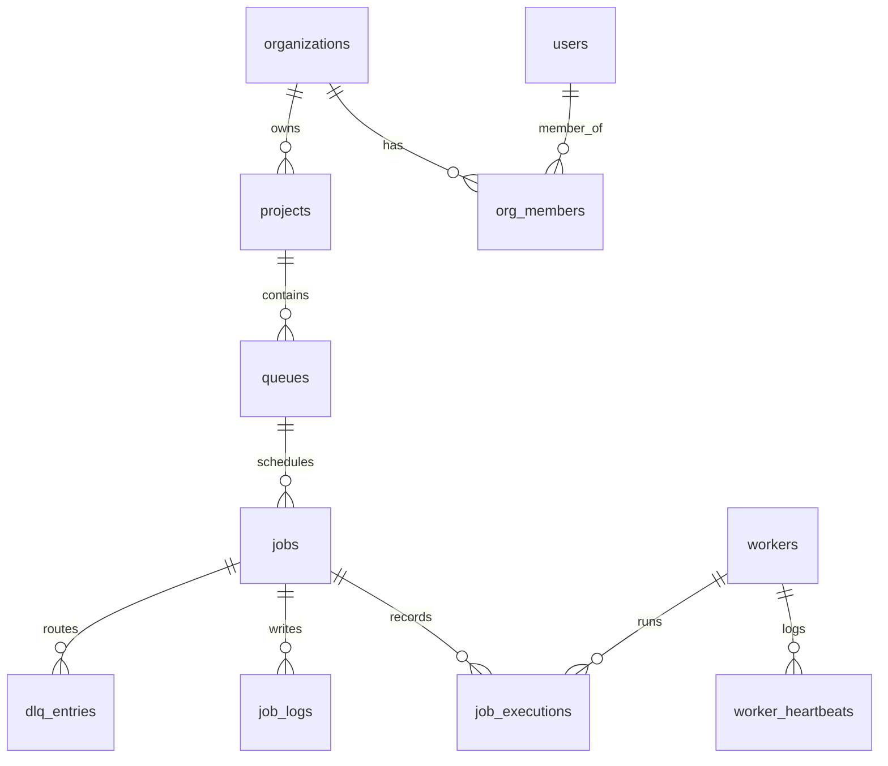

# Entity Relationship Schema Diagram

This document details the database schema, entity constraints, indexes, and performance parameters for the scheduler.

## ER Diagram (Mermaid)

## Relational Schemas

### 1. `users`
Tracks identity credentials and platform roles.
- `id` (UUID, Primary Key)
- `email` (VARCHAR, Unique Index)
- `password_hash` (VARCHAR)
- `name` (VARCHAR)
- `role` (VARCHAR)

### 2. `organizations` & `org_members`
Implements user workspace boundaries and role permission hierarchies (RBAC).
- `org_members` contains a unique index on `(user_id, org_id)`.

### 3. `queues`
Maintains priority queues, execution limits, and rate configurations.
- `concurrency_limit` (INT)
- `max_rate_per_minute` (INT)
- `shard_count` (INT)

### 4. `jobs`
Main record holding task parameters, state machines, and dependencies.
- **Optimized Indexes**:
  - `ix_jobs_claiming` on `(queue_id, status, priority, created_at)` speeds up worker claiming queries.
  - `ix_jobs_scheduled` on `(status, scheduled_at)` speeds up recurring/delayed job evaluations.

### 5. `job_executions`
Audits each execution attempt, logging worker node metadata, duration metrics, and stack traces.

### 6. `dlq_entries`
Stores failed job parameters that exceeded retry policies for manual inspection and AI failure analysis.
