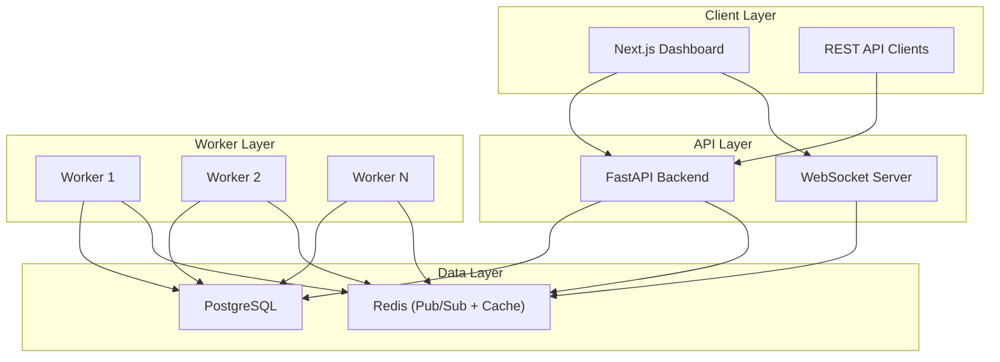
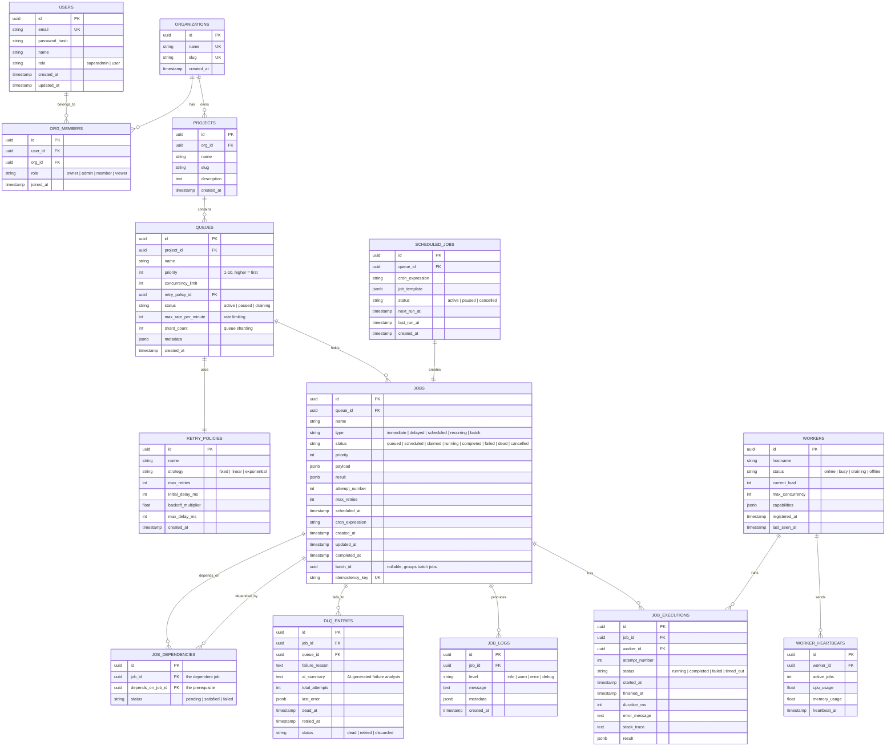

# Distributed Job Scheduler — Platform Specification & Documentation

This comprehensive document serves as the design, schema, and API specification for the **Distributed Job Scheduler** platform, compiling all non-code deliverables.

---

## 1. System Architecture



### Architectural Subsystems

1. **FastAPI Gateway (API Layer)**: Serves REST requests, handles JWT validation, enforces role-based access control (RBAC), and manages WebSocket subscriptions for real-time dashboard events.
2. **Custom Python Worker Service (Worker Layer)**: Runs as separate daemons. Pulls jobs atomically, processes executions concurrently, writes event metrics, registers heartbeat updates, and gracefully drains active worker tasks upon shutdown.
3. **Data Storage & Lock Authority (Data Layer)**: 
   - **PostgreSQL**: Stores relational models, enforces transactional boundaries, and provides high-concurrency atomic updates using row locks.
   - **Redis**: Handles sliding-window rate limit counters and Pub/Sub event distribution.

---

## 2. Database Schema & Design (3NF)

The database schema is fully normalized to 3NF, utilizing composite indexes to optimize job selection and processing latency under high load.

### Entity Relationship Diagram



### Indexed Strategies & Table Optimizations

| Table | Index Columns | Description / Purpose |
| :--- | :--- | :--- |
| `jobs` | `(queue_id, status, priority DESC, created_at)` | Accelerates concurrent job selection and claiming loop. |
| `jobs` | `(status, scheduled_at)` | Speeds up scheduled and delayed job scanning. |
| `jobs` | `(idempotency_key)` **UNIQUE** | Prevents duplicate job submissions. |
| `jobs` | `(batch_id) WHERE batch_id IS NOT NULL` | Speeds up retrieval of jobs grouped within a batch. |
| `job_executions` | `(job_id, attempt_number)` | Speeds up execution history lookups. |
| `workers` | `(status, last_seen_at)` | Fast scanning for dead worker detection. |
| `dlq_entries` | `(queue_id, status)` | Fast loading of items in the Dead Letter Queue. |

- **Partitioning Strategy**: `job_executions` and `job_logs` can be partitioned by range (`created_at`) on a monthly interval to prevent search performance degradation as history grows.
- **Cascading Constraints**: `ON DELETE CASCADE` is set on Queue -> Jobs -> Executions/Logs relationships to ensure data integrity during cleanup. `ON DELETE SET NULL` is mapped to worker references to keep execution history if a worker profile is deleted.

---

## 3. REST API Design

All endpoints support standard pagination parameter arguments (`page`, `pageSize`) and return structured json error responses:

### Authentication
- `POST /api/v1/auth/register` — Register a new account.
- `POST /api/v1/auth/login` — Sign in and receive JWT access & refresh tokens.
- `POST /api/v1/auth/refresh` — Issue a new short-lived access token.
- `GET /api/v1/auth/me` — Retrieve the current user's profile.

### Organizations & Projects
- `POST /api/v1/orgs` — Create a new organization.
- `GET /api/v1/orgs` — List organizations the user belongs to.
- `GET /api/v1/orgs/{org_id}` — Get organization details.
- `POST /api/v1/orgs/{org_id}/members` — Add a user to an organization.
- `PATCH /api/v1/orgs/{org_id}/members/{user_id}` — Change member roles.
- `POST /api/v1/orgs/{org_id}/projects` — Create a project within the organization.
- `GET /api/v1/orgs/{org_id}/projects` — List projects.

### Queues
- `POST /api/v1/projects/{project_id}/queues` — Create a new job queue.
- `GET /api/v1/projects/{project_id}/queues` — List queues with basic statistics.
- `GET /api/v1/queues/{queue_id}` — Retrieve queue configurations and metadata.
- `PATCH /api/v1/queues/{queue_id}` — Update concurrency limit, priorities, or retry policies.
- `POST /api/v1/queues/{queue_id}/pause` — Pause queue processing.
- `POST /api/v1/queues/{queue_id}/resume` — Resume queue processing.
- `GET /api/v1/queues/{queue_id}/stats` — Get queue metrics (depth, throughput, latency).

### Jobs
- `POST /api/v1/queues/{queue_id}/jobs` — Dispatch an immediate, delayed, scheduled, or cron job.
- `POST /api/v1/queues/{queue_id}/jobs/batch` — Dispatch a batch of jobs.
- `GET /api/v1/queues/{queue_id}/jobs` — Filter and browse jobs in a queue.
- `GET /api/v1/jobs/{job_id}` — Retrieve a job's details and attempt history.
- `DELETE /api/v1/jobs/{job_id}` — Cancel a pending or scheduled job.
- `POST /api/v1/jobs/{job_id}/retry` — Manually retry a failed/dead job.
- `GET /api/v1/jobs/{job_id}/logs` — Retrieve console logs for a job.

### Dead Letter Queue (DLQ)
- `GET /api/v1/queues/{queue_id}/dlq` — List dead letter entries.
- `POST /api/v1/dlq/{dlq_id}/retry` — Re-enqueue a dead-lettered job.
- `POST /api/v1/dlq/{dlq_id}/discard` — Dismiss a dead letter entry.
- `GET /api/v1/dlq/{dlq_id}/ai-summary` — Get a Gemini-powered error stack analysis.

### Workers & Telemetry
- `GET /api/v1/workers` — List all registered worker nodes.
- `GET /api/v1/workers/{worker_id}` — Retrieve worker details and recent heartbeat metrics.
- `POST /api/v1/workers/{worker_id}/drain` — Stop a worker from claiming new jobs.
- `GET /api/v1/metrics/overview` — Get system-wide processing rates.

---

## 4. Key Engineering & Concurrency Decisions

### Concurrency & Atomic Claiming
To prevent duplicate job execution, we implement **atomic row claiming** using PostgreSQL's `SELECT ... FOR UPDATE SKIP LOCKED` inside a single update statement:
```sql
WITH claimable AS (
    SELECT j.id
    FROM jobs j
    JOIN queues q ON q.id = j.queue_id
    WHERE j.status = 'queued'
      AND q.status = 'active'
      AND (j.scheduled_at IS NULL OR j.scheduled_at <= NOW())
    ORDER BY q.priority DESC, j.priority DESC, j.created_at ASC
    LIMIT :max_jobs
    FOR UPDATE OF j SKIP LOCKED
)
UPDATE jobs
SET status = 'claimed',
    updated_at = NOW()
FROM claimable
WHERE jobs.id = claimable.id
RETURNING jobs.id, jobs.queue_id, jobs.name, jobs.type, jobs.payload, jobs.attempt_number;
```
This ensures multiple workers can poll the database concurrently without blocking or claiming the same job.

### Distributed Locking
We use PostgreSQL **transactional advisory locks** (`pg_try_advisory_xact_lock`) for critical sections like recurring cron evaluations and DAG dependency state updates. Unlike Redis-based locks, PostgreSQL automatically releases these locks if a worker crashes or drops its database connection, preventing deadlocks.

### Rate Limiting
We use a **Redis-based sliding window rate limiter** on the queue level. Before claiming a job, the worker checks if the queue has exceeded its limit:
```python
current_minute = int(time.time() / 60)
key = f"rate:queue:{queue_id}:{current_minute}"
count = await redis.incr(key)
if count > limit_per_minute:
    # Rate limit exceeded, skip claiming
```

### Heartbeats & Failure Detection
Workers send a heartbeat every 15 seconds to update their `last_seen_at` timestamp and report CPU/memory usage. The backend runs a periodic sweeper to detect stale workers:
```sql
UPDATE workers SET status = 'offline' WHERE last_seen_at < NOW() - INTERVAL '45 seconds';
UPDATE jobs SET status = 'queued', attempt_number = attempt_number + 1 WHERE status = 'running' AND worker_id IN (SELECT id FROM workers WHERE status = 'offline');
```
This automatically reschedules orphaned jobs when a worker node crashes.

### Workflow Dependencies (Job DAGs)
Jobs can define dependencies on other jobs. The scheduler evaluates dependencies using a directed acyclic graph (DAG). When a job completes, it triggers a cascade check:
```python
# Transition dependent jobs to 'queued' if all prerequisites are 'completed'
await session.execute(
    update(JobDependency)
    .where(JobDependency.depends_on_job_id == completed_job_id)
    .values(status="satisfied")
)
```
Cycle detection is enforced at submission time using a Depth-First Search (DFS) check.

---

## 5. Gemini AI-Powered Failure Analysis

When a job fails persistently and enters the Dead Letter Queue (DLQ), users can trigger a Gemini-powered root cause analysis directly from the dashboard:

1. The backend gathers the job's payload, error messages, and execution attempts history.
2. It sends this data to the Google Gemini API with a specialized debugging prompt.
3. The generated summary explains the failure (e.g., database timeout vs. upstream webhook failure) and recommends a fix.
4. The result is cached in the `dlq_entries.ai_summary` column to avoid duplicate API costs.
